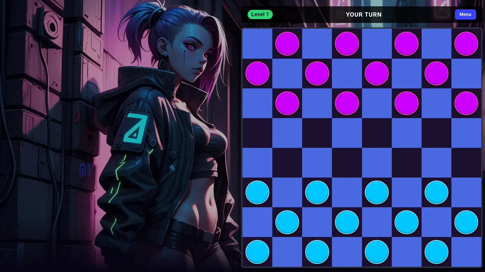

### Play a free web-based version of the Checkers board game featuring European rules

### [Start Game ➜](https://johnnyheggelund.github.io/checkers-european/checkerseu.html)

**Here are the rules for European Checkers:**

Board & Setup: The game is played on an 8x8 board using only the 32 dark squares. Each player starts with 12 pieces placed on the dark squares of the three rows closest to them.

Basic Movement: Regular pieces move diagonally forward one square at a time to an empty adjacent dark square.

Capturing: If an opponent's piece is diagonally adjacent to yours and the square immediately behind it is empty, you must jump over it and land on the empty square, removing the opponent's piece from the board.

**Captures are mandatory.**

If a jump lands you in a position to make another jump, you must continue jumping in the same turn (multi-jump).

Becoming a King: When a regular piece reaches the farthest row (the opponent's king row), it becomes a King.

King Movement: Kings can move diagonally both forward and backward one square at a time. They can also capture both forward and backward.

Winning the Game: You win by either capturing all of your opponent's pieces or blocking them so they have no legal moves left on their turn.
